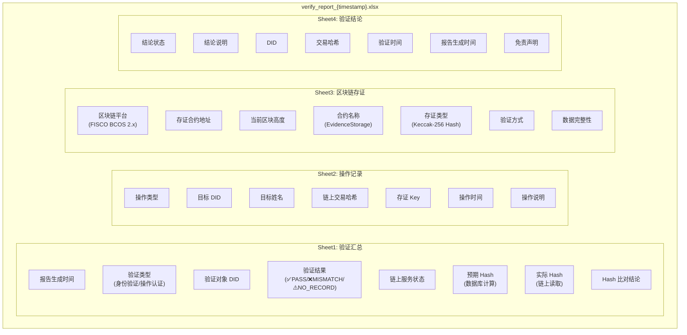

# 基于区块链的数字身份认证系统 — 概要设计说明书

---

## 1. 引言

### 1.1 编写目的

本概要设计说明书旨在描述「基于区块链的数字身份认证系统」的总体架构、功能模块划分、接口与数据设计、关键流程及安全与非功能设计，为详细设计、开发实现、测试与答辩评审提供依据。预期读者包括指导教师、开发人员及答辩评委。

### 1.2 背景与范围

- **项目名称**：基于区块链的数字身份认证系统（digital-identity-auth）。
- **项目背景**：面向企业数字身份的可信管理，结合区块链存证与 AI 风控，实现身份注册、凭证核验、操作可追溯与风险防控。
- **范围**：本设计覆盖后端业务服务（auth-service）、与 FISCO BCOS 链的集成、以及可选 AI 风控服务（python-risk）的接口与协作方式；不包含链节点本身的部署细节及前端框架的详细实现。

### 1.3 术语与缩略语

| 术语/缩略语 | 说明 |
|------------|------|
| DID | 去中心化标识符（Decentralized Identifier），本系统格式为 did:blockdia:emp:{工号} |
| 存证 | 将业务数据的内容哈希写入区块链，用于防篡改与事后核验 |
| FISCO BCOS | 国产开源联盟链平台，本系统采用 2.x 版本及 Web3SDK |
| 链上验证 | 通过区块链查询存证哈希，与当前业务数据哈希比对，判断是否一致 |
| 风控 | 风险控制，本系统中指基于行为特征的异常检测与风险等级评估、升级与拦截 |
| 规则引擎 | 基于可配置权重与阈值的评分逻辑，不依赖外部模型 |
| 审计日志 | 记录权限修改、DID 注销等操作的日志，并支持上链存证 |

### 1.4 参考文档

- 需求规格说明书（若有）
- 前期工作小结（Java 设计、区块链设计、AI 风控设计）
- Spring Boot、MyBatis-Plus、FISCO BCOS 官方文档
- 项目内 `application.properties`、`schema.sql` 及 `docs` 目录下相关说明

---

## 2. 系统总体设计

### 2.1 设计目标与原则

- **可信存证**：身份与关键操作的结果以哈希形式写入区块链，不可篡改、可追溯。
- **可验证**：支持按 DID 核验身份凭证与链上存证是否一致，按交易哈希核验操作是否上链。
- **安全与隐私**：链上仅存哈希不存明文；认证与权限分离，支持管理员与普通用户双轨登录。
- **可扩展与可降级**：区块链与 AI 模型均可通过配置关闭，系统在仅数据库环境下仍可运行核心身份与审计功能。
- **可维护**：分层清晰、模块职责单一，便于后续功能扩展与问题排查。

### 2.2 系统总体架构

系统采用分层逻辑架构，自顶向下分为：

1. **表现层**：Thymeleaf 模板渲染的 Web 页面（首页、登录、注册、查询、凭证、权限管理、审计、存证记录、链上验证、风险报告等），以及供前端调用的 REST API。
2. **业务层**：身份与 DID 管理、认证与权限、审计日志、区块链存证与链上验证、AI 风控（行为记录、规则引擎、模型调用、风险升级）、仪表盘统计等核心业务逻辑。
3. **数据与外部服务层**：MySQL 持久化（身份表、审计表）；FISCO BCOS 链上存证与查询；可选 Python 风控服务（HTTP 调用）。

各层之间通过接口与依赖注入协作，区块链与风控模块采用条件装配，未配置时不加载，实现“开关式”扩展。

### 2.3 技术架构

| 层次 | 技术选型 | 说明 |
|------|----------|------|
| 运行框架 | Spring Boot 2.3.12 | Web、配置、依赖管理 |
| 持久层 | MyBatis-Plus、MySQL 8 | 身份、审计数据存储 |
| 表现层 | Thymeleaf | 服务端页面渲染 |
| 区块链 | FISCO BCOS 2.x、Web3SDK 2.4.1 | 存证合约调用、Channel 连接 |
| 风控 | 自研规则引擎 + 可选 Python (Flask, sklearn) | 行为特征、异常检测模型 |
| 工具 | Hutool、Lombok | 哈希、工具类、简化代码 |

### 2.4 部署架构

- **应用服务**：auth-service 单应用，默认端口 8080，可单机或与 MySQL、链节点分离部署。
- **数据库**：MySQL，需预先创建数据库 `identity_db` 并执行 `schema.sql` 初始化表结构。
- **区块链**：FISCO BCOS 节点（本机或虚拟机），配置 Channel 端口、群组 ID 及 SDK 证书；需预先部署存证合约并配置合约地址。
- **Python 风控服务**（可选）：在 `auth-service/python-risk` 下运行 `python app.py`，监听 5000 端口，提供 POST /predict；不启动时系统自动降级为规则引擎。

---

## 3. 功能模块设计

### 3.1 模块划分总览

系统按职责划分为以下功能模块，对应代码包与入口如下：

| 模块 | 主要职责 | 主要类/包 |
|------|----------|------------|
| 身份与 DID | 注册、DID 生成、查询、列表、角色修改、注销 | IdentityController, IdentityService/Impl, Entity.Identity |
| 认证与权限 | 管理员/测试用户登录、Session、登出、页面权限控制 | AuthController, RegisterController |
| 审计 | 审计日志记录、上链、列表查询 | AuditLogController, AuditLogService/Impl, Entity.AuditLog |
| 区块链存证与验证 | 存证写入、身份验证、操作认证、区块高度 | ChainVerifyController, blockchain 包, BlockchainConfig |
| AI 风控 | 行为记录、规则评分、模型调用、风险升级、拒绝 | AiRiskEngine, BehaviorRecordService, RiskEscalationService, RiskController |
| 仪表盘统计 | 今日验证次数、今日中高风险事件数 | DashboardStatsService |
| 存证与验证展示 | 存证记录列表页、链上验证入口与结果展示 | EvidenceRecordController, 相关模板 |
| 验证报告导出 | 链上验证结果 Excel 报告生成与下载 | ChainVerifyController.exportReport |

模块间依赖关系：身份模块依赖区块链存证接口；链上验证与身份查询依赖风控与仪表盘；审计模块在权限修改与注销时被身份服务调用，并依赖区块链存证。

### 3.2 身份与 DID 模块

- **功能概述**：实现企业内数字身份的注册、唯一标识（DID）生成、多维度查询、列表展示、角色更新与 DID 注销；注册与权限/注销操作与审计、链上存证联动。
- **DID 规则**：应用内生成，格式 `did:blockdia:emp:{工号}`，工号唯一则 DID 唯一；与数据库唯一约束一致。
- **核心能力**：
  - 注册：校验工号唯一 → 生成 DID → 入库 → 计算身份内容哈希 → 调用链上存证（key=DID）→ 回写交易哈希与区块号。
  - 查询：支持按 DID、工号查询单条身份；列表返回全部身份（供权限管理）；按主键查询用于凭证页。
  - 权限：修改角色（员工/超级管理员）、注销 DID；二者均写审计并上链（审计存证 key 为 audit_{id}）。
- **数据依赖**：did_identity 表，Identity 实体；依赖 IdentityMapper、ChainEvidenceService、AuditLogService。

### 3.3 认证与权限模块

- **功能概述**：提供管理员与测试用户两套登录入口，基于 Session 的认证与登出，以及对管理员专属页面的访问控制。
- **登录分离**：
  - 管理员：仅通过 `/api/login` 登录，账号密码由配置项 admin.username / admin.password 指定；拒绝测试账号在此入口登录。
  - 测试用户：仅通过 `/api/login/test` 登录，账号限定为 user1、user2、user3，密码固定；拒绝管理员在此入口登录。
- **Session 约定**：登录成功后写入 Session（admin 标识、user 用户名）；登出清除 admin、user 及风控相关 Session 状态；已升级为“拒绝”的用户 ID 持久在服务内存，不随登出清除。
- **页面权限**：管理员页（如 /admin/permissions、/admin/audit）在 Controller 中校验 Session 的 admin 属性，未登录则重定向至 /login。

### 3.4 审计模块

- **功能概述**：记录权限修改（UPDATE_ROLE）、DID 注销（REVOKE_DID）等操作，并将每条审计记录的内容哈希写入区块链（key=audit_{日志id}），支持后续按交易哈希做操作认证。
- **记录内容**：操作类型、目标身份 ID、DID、工号、姓名、操作说明（detail）、操作时间；上链成功后保存 chain_tx_hash、chain_block_number。
- **调用关系**：由 IdentityServiceImpl 在 updateRole、revoke 时调用 AuditLogService.save；审计服务内部完成入库与调用 ChainEvidenceService 上链。
- **查询**：提供 /api/audit/list 按时间倒序返回审计列表，供管理端展示。

### 3.5 区块链存证与验证模块

- **功能概述**：在 fisco.enabled=true 且配置合约地址时，向 FISCO BCOS 上的 EvidenceStorage 合约写入/读取 key-hash 存证；对外提供身份验证（按 DID）、操作认证（按交易哈希）及区块高度查询。
- **存证键规范**：身份存证 key = DID；审计存证 key = "audit_" + 审计日志主键 id。
- **存证内容**：不存明文，仅存业务内容的哈希（Identity/AuditLog 的 buildContentString 经 UTF-8 SHA256 的 hex）。
- **验证逻辑**：
  - 身份验证：根据 DID 查库得当前凭证 → 算 expectedHash → 合约 get(did) 得 actualHash → 比较返回 PASS / MISMATCH / NO_RECORD。
  - 操作认证：根据 txHash 先查审计表，若无再查身份表 → 对命中记录算 hash → 合约 get(key) 比对。
- **降级**：fisco.enabled=false 或未配置合约时，ChainEvidenceService 使用 NoOp 实现，不连链，业务侧兼容 null 返回值。

### 3.6 AI 风控模块

- **功能概述**：对身份查询、链上验证等敏感操作进行行为记录，并基于近期行为统计输出风险等级（低/中/高）。当风险进入中风险预警后，若继续高频操作达到阈值，则升级为高风险并拒绝后续请求；同时支撑仪表盘统计“今日验证次数”“今日中高风险事件数”，形成可视化闭环。
- **行为记录**：`BehaviorRecordService` 按用户维度在内存中记录 `ACTION_IDENTITY_QUERY`、`ACTION_CHAIN_VERIFY` 及时间戳，并按时间窗口与条数上限裁剪数据，避免无限增长；这些行为记录用于后续统计特征与风险评估。
- **规则引擎**：基于滑动时间窗统计四个特征（`count_verify_1m`、`count_query_1m`、`count_verify_5m`、`count_query_5m`），对 1 分钟窗口与 5 分钟窗口进行加权求和得到 `score`；当前判定口径为 `score>=60` 为中风险、`score>=80` 为高风险；该部分无需外部依赖，便于可解释与降级运行。
- **模型调用（Python 异常检测）**：当 `ai.risk.model.enabled=true` 时，将四个特征（`count_verify_1m`、`count_query_1m`、`count_verify_5m`、`count_query_5m`）以 JSON POST 到配置的 Python 服务 URL（如 `http://localhost:5000/predict`），读取返回的 `risk_level`/`anomaly_score`；Python 侧加载 `model.pkl` 使用 IsolationForest 进行无监督异常检测，基于 `decision_function` 经 sigmoid 映射得到 0~1 的异常分值并按阈值映射等级（`>=0.8` 高、`>=0.6` 中，否则低）；Java 侧设置超时（如 `ai.risk.model.timeoutMs`），超时或返回异常则自动降级为规则引擎，并在响应中体现风险来源（`riskSource=rule/model`）。
- **风险升级**：`RiskEscalationService` 在中风险预警后实现“预警后升级拦截”。第一次命中中风险时在 Session 标记“已预警”；若后续再次命中中风险则累计“预警后操作次数”，达到阈值（当前实现为 3 次）后将用户加入内存集合 `blockedUserIds`；后续请求进入时先检查 `isBlocked(session)`，命中则直接返回拒绝响应（风险等级按高风险展示），从而拦截身份查询与链上验证。
- **集成点**：身份查询 API 与链上验证 API 在响应中附带 `risk` 对象（风险是否命中、风险等级、分数/说明与来源）；风险报告页通过 `/api/risk/check` 获取当前用户风险结果。`DashboardStatsService` 用于统计：链上验证入口累加“今日验证次数”，当风险为中/高或触发拒绝拦截时累加“今日中高风险事件数”，支撑首页展示。

### 3.7 存证与验证展示模块

- **功能概述**：提供存证记录浏览与链上验证操作的页面入口及结果展示，不改变现有业务逻辑。
- **存证记录**：/blockchain/evidence 选择身份存证或审计存证；/blockchain/evidence/identity、/blockchain/evidence/audit 分页展示已上链记录（每页 6 条）。
- **链上验证**：/blockchain/verify 选择身份验证或操作认证；/blockchain/verify/identity（输入 DID）、/blockchain/verify/audit（输入 txHash）提交后调用后端 API 并展示 PASS/MISMATCH/NO_RECORD 等结果。

### 3.8 验证报告导出模块

- **功能概述**：对已完成链上验证的身份或操作，支持导出标准化 Excel 格式的验证报告，供存档、审计或线下复核使用。
- **导出入口**：
  - 前端页面（验证结果展示页）：验证成功后显示「导出验证报告」按钮，点击触发下载；
  - 直接 API 调用：`GET /api/chain/report/export?did=xxx` 或 `GET /api/chain/report/export?txHash=xxx`。
- **报告结构**：Excel 工作簿包含 4 个 Sheet：
  - **验证汇总**：报告生成时间、验证类型（身份验证/操作认证）、验证对象 DID、验证结果（PASS/MISMATCH/NO_RECORD）、链上服务状态、预期 Hash（数据库计算）、实际 Hash（链上合约读取）、Hash 比对结论；
  - **操作记录**：若为审计操作则展示操作类型、目标 DID、目标姓名、链上交易哈希、存证 Key、操作时间、操作说明；若为身份注册则展示 DID、链上交易哈希、注册时间等；
  - **区块链存证**：区块链平台（FISCO BCOS 2.x）、存证合约地址、当前区块高度、合约名称、存证类型、验证方式、数据完整性判定；
  - **验证结论**：结论状态（✅验证通过/❌验证不通过/⚠️无链上记录/⚠️验证异常）、结论说明、DID、交易哈希、验证时间、免责声明。
- **文件名规范**：`verify_report_{yyyyMMdd_HHmmss}.xlsx`，如 `verify_report_20260402_143052.xlsx`。
- **数据依赖**：
  - 按 `txHash` 导出：先查 `audit_log`（操作认证），若未命中再查 `did_identity`（身份注册）；
  - 按 `did` 导出：直接查 `did_identity` 并从链上合约读取存证 Hash；
  - 链上 Hash：通过 `EvidenceStorageContract.get(web3j, credentials, gasProvider, contractAddress, key)` 读取。
- **降级**：若区块链服务未配置，报告仍可生成，但链上 Hash 相关字段显示为空或"未配置"；验证结论根据实际情况标注。

### 3.9 验证报告导出流程图

```mermaid
flowchart TD
    A[用户发起导出请求<br/>did 或 txHash] --> B{传入参数判断}
    
    B -->|传入 did| C[按 DID 查询身份记录]
    B -->|传入 txHash| D[按 txHash 查询审计记录]
    
    D --> E{审计记录存在?}
    E -->|是| F[获取审计关联身份]
    E -->|否| G[按 txHash 查询身份记录]
    
    C --> H[计算数据库 Hash<br/>Identity.computeContentHash]
    F --> I[计算数据库 Hash<br/>AuditLog.computeContentHash]
    G --> H
    
    H --> J[查询链上合约<br/>EvidenceStorageContract.get]
    I --> J
    
    J --> K[获取链上实际 Hash]
    
    K --> L{Hash 比对}
    L -->|一致| M[状态: PASS ✅]
    L -->|不一致| N[状态: MISMATCH ❌]
    L -->|链上无记录| O[状态: NO_RECORD ⚠️]
    
    M --> P[生成 Excel 报告<br/>4 Sheet 结构]
    N --> P
    O --> P
    
    P --> Q[Sheet1: 验证汇总]
    P --> R[Sheet2: 操作记录]
    P --> S[Sheet3: 区块链存证]
    P --> T[Sheet4: 验证结论]
    
    Q --> U[返回文件下载<br/>verify_report_{timestamp}.xlsx]
    R --> U
    S --> U
    T --> U
```

### 3.10 验证报告结构图



---

## 4. 接口设计

### 4.1 接口设计说明

- **风格**：RESTful，JSON 请求与响应；统一使用 UTF-8。
- **通用约定**：业务成功时多数接口返回 `success: true`，并附带 `message`、业务数据；失败时 `success: false`，`message` 为错误说明。链上验证类接口使用 `status`（如 PASS、MISMATCH、NO_RECORD、ERROR）表示核验结果。
- **认证**：管理端与需区分身份的接口依赖 Session（Cookie）；部分 API 未做显式鉴权，依赖前端或后续增加的拦截器。

### 4.2 主要 REST API 清单

| 分类 | 方法 | 路径 | 简要说明 |
|------|------|------|----------|
| 认证 | POST | /api/login | 管理员登录 |
| 认证 | POST | /api/login/test | 测试用户登录 |
| 身份 | POST | /api/register | 身份注册（工号、姓名、部门等） |
| 身份 | GET | /api/identity/{id} | 按主键获取身份 |
| 身份 | GET | /api/identity/query | 按 DID 或工号查询 |
| 身份 | GET | /api/identity/list | 身份列表（权限管理） |
| 身份 | PUT | /api/identity/{id}/role | 修改角色 |
| 身份 | DELETE | /api/identity/{id} | 注销 DID |
| 链 | GET | /api/chain/block-number | 当前链上区块高度 |
| 链 | GET | /api/chain/verify/identity | 身份链上验证（参数 did） |
| 链 | GET | /api/chain/verify/audit | 操作认证（参数 txHash） |
| 审计 | GET | /api/audit/list | 审计日志列表 |
| 风控 | GET | /api/risk/check | 当前用户风险检查结果 |
| 导出 | GET | /api/chain/report/export | 导出验证报告（参数 did 或 txHash） |

### 4.3 与区块链的接口

- **合约**：EvidenceStorage，提供 set(string key, string hash)、get(string key) view。
- **调用方式**：Java 通过 Web3j 编码 Function 调用，不依赖合约 BIN 部署信息；Gas 使用 StaticGasProvider 固定值。
- **键与值**：key 为业务键（DID 或 "audit_" + id）；value 为对应 Identity/AuditLog 内容哈希（UTF-8 SHA256 hex），与业务侧 buildContentString + computeContentHash 一致。

### 4.4 与 AI 风控服务的接口

- **URL**：由配置项 ai.risk.model.url 指定，如 http://localhost:5000/predict。
- **方法**：POST，Content-Type: application/json。
- **请求体**：JSON，包含 count_verify_1m、count_query_1m、count_verify_5m、count_query_5m（均为数值）。
- **响应**：需包含 risk_level（"高"|"中"|"低"）；可选 anomaly_score 等。若请求超时或解析失败，Java 侧降级为规则引擎结果。
- **超时**：由 ai.risk.model.timeoutMs 配置（如 2000 ms）。

---

## 5. 数据设计

### 5.1 数据设计说明

- **持久化**：MySQL 存储身份与审计数据，由 schema.sql 在应用启动时初始化表（若不存在）。
- **链上**：存证为 key-hash 键值对，由合约 EvidenceStorage 管理，不直接存储业务明文。
- **内存**：行为记录、风险升级“已拒绝”用户集合、仪表盘按日计数等存于应用内存，重启后清空。

### 5.2 核心实体与表结构

**did_identity（身份表）**

| 字段 | 类型 | 说明 |
|------|------|------|
| id | bigint | 主键，自增 |
| employee_id | varchar(64) | 工号，唯一 |
| name | varchar(64) | 姓名 |
| department | varchar(64) | 部门 |
| position | varchar(128) | 职位，可选 |
| role | varchar(32) | 角色：员工、超级管理员，默认员工 |
| did | varchar(256) | DID，唯一 |
| created_at | datetime | 创建时间 |
| chain_tx_hash | varchar(128) | 上链交易哈希，可选 |
| chain_block_number | bigint | 上链区块号，可选 |

**audit_log（审计日志表）**

| 字段 | 类型 | 说明 |
|------|------|------|
| id | bigint | 主键，自增 |
| operation_type | varchar(32) | UPDATE_ROLE / REVOKE_DID |
| target_identity_id | bigint | 目标身份主键 |
| target_did | varchar(256) | 目标 DID |
| target_employee_id | varchar(64) | 目标工号 |
| target_name | varchar(64) | 目标姓名 |
| detail | varchar(512) | 操作说明 |
| operated_at | datetime | 操作时间 |
| chain_tx_hash | varchar(128) | 上链交易哈希，可选 |
| chain_block_number | bigint | 上链区块号，可选 |

**backup_record（备份记录表）**

| 字段 | 类型 | 说明 |
|------|------|------|
| id | bigint | 主键，自增 |
| backup_type | varchar(32) | 备份类型：FULL（完整备份） |
| file_path | varchar(512) | 备份文件存储路径 |
| file_size | bigint | 备份文件大小（字节） |
| backup_time | datetime | 备份执行时间 |
| status | varchar(16) | 备份状态：SUCCESS / FAILED |
| duration_seconds | int | 备份耗时（秒） |
| error_message | varchar(1024) | 失败时的错误信息 |
| operator | varchar(64) | 操作人（系统自动备份时为 SYSTEM） |
| remark | varchar(256) | 备注信息 |

### 5.3 存证内容与哈希规则

- **身份**：Identity.buildContentString 拼接 did、employeeId、name、department、position、role、createdAt（格式 yyyy-MM-dd'T'HH:mm:ss），UTF-8 SHA256 取 hex，即 Identity.computeContentHash。注册与链上验证共用，确保一致。
- **审计**：AuditLog.buildContentString 拼接 operationType、targetDid、targetName、detail、operatedAt（同上时间格式），UTF-8 SHA256 取 hex，即 AuditLog.computeContentHash。写入与操作认证时共用。

### 5.4 行为与风控数据

- **行为记录**：单条记录包含 userId、actionType（CHAIN_VERIFY / IDENTITY_QUERY）、timestamp（毫秒）；按用户维度的队列，保留 5 分钟内或最多 500 条，超出则淘汰。
- **风险结果**：RiskResult 包含 riskDetected、riskLevel（低/中/高）、score、message、riskSource（rule/model），用于 API 返回与前端展示。

### 5.5 数据库备份与恢复

- **功能概述**：提供基于 mysqldump 的数据库逻辑备份功能，支持手动触发与自动定时备份，确保身份、审计等业务数据可恢复。
- **备份方式**：调用 mysqldump 工具执行 SQL 导出，使用 `--single-transaction` 保证 InnoDB 表的备份一致性，同时支持 `--routines`、`--triggers`、`--events`、`--hex-blob` 保留存储过程、触发器、事件及二进制数据。
- **备份配置**：

| 配置项 | 说明 | 示例值 |
|--------|------|--------|
| backup.directory | 备份文件存储目录 | ./backups |
| backup.mysqldump-path | mysqldump 工具路径 | D:/MySQL/MySQL Server 8.0/bin/mysqldump |
| backup.auto.enabled | 是否启用自动备份 | true |
| backup.auto.cron | 自动备份 Cron 表达式 | 0 0 2 * * ?（每日凌晨 2 点） |

- **备份内容**：每次备份导出完整的 `identity_db` 数据库，包含 did_identity（身份表）、audit_log（审计日志表）等所有业务表及数据。
- **文件命名**：格式 `{数据库名}_{yyyyMMdd_HHmmss}.sql`，如 `identity_db_20260401_020000.sql`。
- **恢复方式**：通过执行 `mysql -u用户名 -p密码 数据库名 < 备份文件.sql` 导入恢复。
- **关键实现**：
  - 使用 ProcessBuilder 直接调用 mysqldump 可执行文件，避免 shell 解析路径时的空格问题；
  - ProcessBuilder 通过 `redirectOutput()` 将导出内容直接写入文件，绕过 shell 重定向；
  - 备份前解析 JDBC URL 提取数据库名，备份后验证文件存在且大小大于 0，记录备份结果（含文件路径、大小、耗时）。

---

## 6. 关键流程设计

### 6.1 身份注册与上链流程

1. 接收注册参数（工号、姓名、部门、职位、角色），校验工号、姓名、部门必填且工号不重复。
2. 生成 DID（did:blockdia:emp:{工号}），构造 Identity 并写入 did_identity。
3. 从数据库取出刚插入的记录（保证时间精度与库一致），计算 contentHash = Identity.computeContentHash(identity)。
4. 若区块链已启用且合约地址已配置，调用 ChainEvidenceService.saveEvidence(did, contentHash)；若返回 EvidenceResult，将 transactionHash、blockNumber 写回 identity 并更新数据库。
5. 返回成功及身份信息（含 id、did、chainTxHash 等）给前端。

### 6.2 身份链上验证流程

1. 接收参数 did（必填），可选从 Session 取当前用户；若风控已拒绝该用户，直接返回拒绝响应。
2. 记录行为（链上验证），仪表盘今日验证次数 +1。
3. 按 did 查询身份，若无则返回 NO_RECORD。
4. 若链未配置或未就绪，返回 ERROR。
5. 计算 expectedHash = Identity.computeContentHash(identity)；调用合约 get(did) 得 actualHash。
6. 若链上无记录（actualHash 为空），返回 NO_RECORD；若 actualHash 与 expectedHash 一致返回 PASS，否则返回 MISMATCH。
7. 附带当前用户风控评估结果（risk），并执行风险升级逻辑（若有）；若结果为中/高风险，仪表盘今日中高风险事件数 +1。

### 6.3 操作认证流程

1. 接收参数 txHash（必填），风控与行为记录同身份验证。
2. 按 chain_tx_hash 先查 audit_log，若命中则取该审计记录，计算 expectedHash = AuditLog.computeContentHash(log)，合约 get("audit_" + id) 得 actualHash，比较后返回 PASS/MISMATCH/NO_RECORD。
3. 若审计未命中，再按 chain_tx_hash 查 did_identity，若命中则按身份记录算 hash 并与合约 get(did) 比较，同上。
4. 若均未命中，返回 NO_RECORD 提示未找到对应存证。

### 6.4 权限变更与审计上链流程

1. **修改角色**：校验身份存在，更新 role 字段并 updateById；调用 AuditLogService.save(OPERATION_UPDATE_ROLE, id, did, employeeId, name, "旧角色 -> 新角色")。审计服务内插入 audit_log，计算 contentHash，调用 ChainEvidenceService.saveEvidence("audit_" + log.getId(), contentHash)，回写 txHash/blockNumber。
2. **注销 DID**：校验身份存在，先调用 AuditLogService.save(OPERATION_REVOKE_DID, ...)，再 deleteById 删除身份记录。审计上链逻辑同上。

### 6.5 风控评估与升级流程

1. 请求进入身份查询或链上验证时，先记录行为（userId, actionType, timestamp）。
2. 取近期行为（如 5 分钟内），统计 1 分钟/5 分钟内验证与查询次数，计算规则得分；若启用模型则 POST 特征到 /predict，解析 risk_level，超时或失败则用规则结果。
3. 根据得分或模型结果得到 RiskResult（riskLevel 低/中/高），写入响应 risk 字段。
4. RiskEscalationService.applyAfterRequest：若本次为中风险则标记“已中风险预警”；若此前已预警则本请求计为“预警后又一次操作”，累加次数，达到阈值则置为“拒绝”并加入 blockedUserIds。
5. 后续请求若 isBlocked(session) 为 true，直接返回拒绝响应，不再执行业务与风控计算；仪表盘在拒绝或中高风险时增加今日中高风险事件数。

### 6.6 用户认证与访问控制流程

1. 用户访问管理员登录页 /login 或测试用户登录页 /login/test，提交用户名密码到对应 POST 接口。
2. 服务端校验账号类型与密码，通过则设置 Session（admin/user），清除风控 Session 状态，返回 success。
3. 访问 /admin/* 等管理员页时，Controller 检查 Session 中 admin 属性，缺失则重定向到 /login?redirect=原路径。
4. 登出 /logout 清除 Session 中 admin、user 及风控相关属性，重定向首页；blockedUserIds 不清除，已拒绝用户仍无法通过登录恢复访问敏感接口。

---

## 7. 安全与非功能设计

### 7.1 安全设计

- **认证**：管理员与测试用户分入口登录，密码与账号由配置或固定规则控制；Session 存储登录状态，登出清除。
- **敏感配置**：数据库密码、管理员密码等写在 application.properties，建议生产使用环境变量或加密配置，并区分环境。
- **接口鉴权**：管理员页通过 Controller 校验 Session；部分 API（如 identity/list、修改角色、注销）未做统一鉴权，建议通过拦截器或 AOP 按角色拦截，防止越权。
- **链上隐私**：链上仅存内容哈希，不存明文，降低泄露风险；key 为 DID 或 audit_id，可根据需要后续引入加密或访问控制。

### 7.2 可靠性设计

- **区块链降级**：fisco.enabled=false 或未配置合约时，存证服务为 NoOp，不连链，业务仍可完成注册与审计（仅无链上存证）。
- **风控降级**：Python 服务不可用或超时时，自动使用规则引擎结果，不阻塞主流程。
- **异常处理**：全局 @RestControllerAdvice 将未捕获异常转为统一 JSON，避免 500 直接暴露；链上与风控调用处捕获异常并返回明确提示。

### 7.3 可扩展性设计

- **模块化**：身份、审计、区块链、风控分包分模块，存证通过 ChainEvidenceService 接口与条件装配切换实现。
- **风控扩展**：规则权重与阈值、模型 URL 与开关均配置化；可扩展更多行为类型或特征而不影响现有接口。
- **链与合约**：合约地址与节点配置外置，便于更换节点或合约版本；哈希规则与 key 规范统一，便于多链或多合约扩展（需后续实现）。

### 7.4 其他

- **日志**：区块链模块具备关键操作日志；建议业务层统一日志格式（操作、用户、结果），便于排查与审计。
- **性能**：当前为单机、演示级设计；大量存证或高并发场景可考虑异步上链、批量写入或缓存，作为后续优化方向。

---

## 附录 A 主要 REST API 一览

| 方法 | 路径 | 说明 |
|------|------|------|
| POST | /api/login | 管理员登录 |
| POST | /api/login/test | 测试用户登录 |
| POST | /api/register | 身份注册 |
| GET | /api/identity/{id} | 按 ID 获取身份 |
| GET | /api/identity/query | 按 DID 或工号查询 |
| GET | /api/identity/list | 身份列表 |
| PUT | /api/identity/{id}/role | 修改角色 |
| DELETE | /api/identity/{id} | 注销 DID |
| GET | /api/chain/block-number | 链区块高度 |
| GET | /api/chain/verify/identity | 身份链上验证 |
| GET | /api/chain/verify/audit | 操作认证 |
| GET | /api/audit/list | 审计列表 |
| GET | /api/risk/check | 风险检查 |

---

## 附录 B 存证合约接口说明

- **合约名**：EvidenceStorage（Solidity）。
- **set(string key, string hash)**：写入一条存证，key 为业务键（DID 或 "audit_" + id），hash 为内容哈希 hex。
- **get(string key) view returns (string)**：查询 key 对应的 hash，不存在则返回空字符串。
- **事件**：SetRecord(key, hash)。Java 侧通过 Web3j Function 编码调用 set/get，无需 ABI/BIN 文件参与运行时调用。

---

## 附录 C 风控特征与阈值说明

- **特征**：count_verify_1m（1 分钟内链上验证次数）、count_query_1m（1 分钟内身份查询次数）、count_verify_5m、count_query_5m。
- **规则权重（示例）**：1 分钟内验证 2.0、查询 1.0；5 分钟内验证 0.5、查询 0.3；加权求和得 score。
- **规则阈值**：score ≥ 60 判中风险，≥ 80 判高风险；与 Python 模型等级映射（0.6/0.8 对应中/高）一致。
- **升级**：中风险预警后继续操作达到设定次数（如 3 次）则升级为高风险并拒绝后续请求；拒绝状态按用户 ID 持久在内存。

---

*文档版本：1.0 | 基于当前 auth-service 代码与配置整理*
